# Picocell Amazon Web Services Connection via MQTT

This section will lead you step by step to create a cellular connection to the Amazon Web Services with the Picocell and MQTT protocol.

## Description

The Picocell provides all the components you will need for establishing an MQTT connection to the Amazon Web Services' IoT Core. You don't need any additional hardware equipments for this example.

Getting started is pretty straight forward, first you will setup the hardware then complete the example code to start the connection. Each of the steps are mentioned in detail below.

## System Requirements

To getting started with the Picocell, first check the following requirements.

| Hardware Requirements                                        | Software Requirements |
| ------------------------------------------------------------ | --------------------- |
| - A Picocell module<br />-Quactel BG95 modem<br />- A antenna<br />- A micro USB to USB-A converter | - Thonny IDE          |

## Hardware Setup

You can complete the hardware installation by following the steps below.

1. **Carefully plug your Quectel BG95 modem into the socket of your Sixfab Raspberry Pi Pico IoT Kit.**
   

2. **After installing your modem as shown in the image in step one, gently push the airborne edge with your finger and place it on the mechanical bed.**

   

3. **Connect the GPS and LTE cables of your Pulse antenna to the antenna sockets indicated in the image below.**

   

   

4. **As a final step, connect your microUSB to USB-A converter to your board as in the image below so that you can program your development board.**

   

5. **Connect the USB-A to your own computer. Check if the power switch is ON.**

## Software Setup

We have completed the hardware setup, now we will install MicroPython to our development board and the Picocell SDK. Afterwards, we're going to connect to the Amazon Web Services' MQTT Broker with our credentials.

### Preparing Coding Environment

1. Upload MicroPython binary file into the development board's file system. You can follow the instructions on the MicroPython's website [on this link.](https://micropython.org/download/rp2-pico/)
2. Install Thonny IDE into your computer. You can follow the instructions on [its official website](https://thonny.org/).
3. Download the Picocell SDK code from [this GitHub repository](https://github.com/sixfab/picocell_python-sdk/).
4. Copy the `core` directory from the repository into the Picocell's file system.
5. Copy the file named _aws_mqtts_example_with_manager.py_ to your Picocell.
6. Create a `config.json` file in the Picocell's file system.

### Register and Activate AWS IoT Service

1. Register or login to your AWS account. You may want to follow [this tutorial](https://aws.amazon.com/tr/premiumsupport/knowledge-center/create-and-activate-aws-account/) on Amazon Web Services' documentation.

2. Type **IoT Core** onto the search bar, and choose the service which has the same name with what we wrote.

3. After redirecting to service's dashboard, click the **Security** drop-down menu from the **Manage** section in the sidebar, and select **Policies**. Click to **Create policy** button as shown in the image. 

   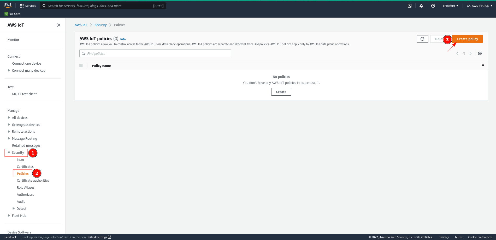

4. Type a policy name for your devices, set the policy effect as **Allow**, its action and resource as ***** (which means _all_),  and click **Create**.

   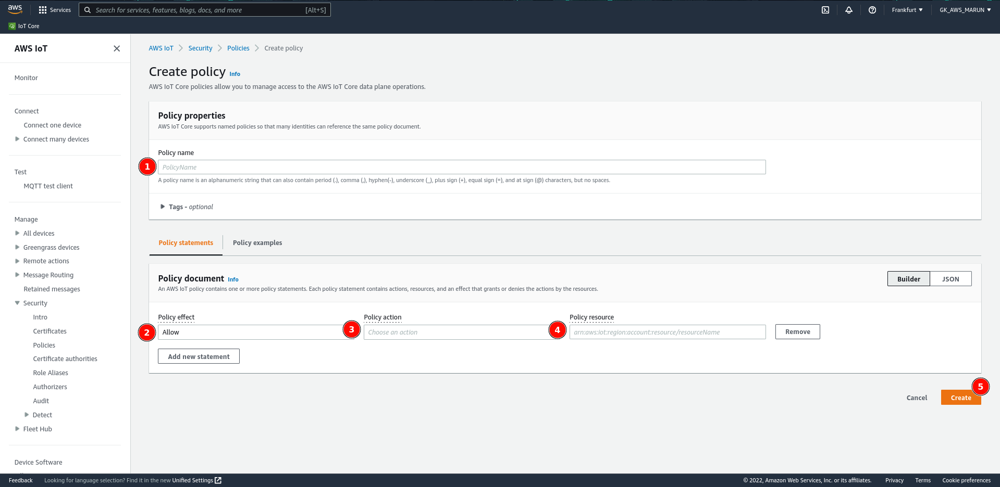

5. Select **All devices** from the menu, and click to the **Things**. Create a new device using **Create things** button.

   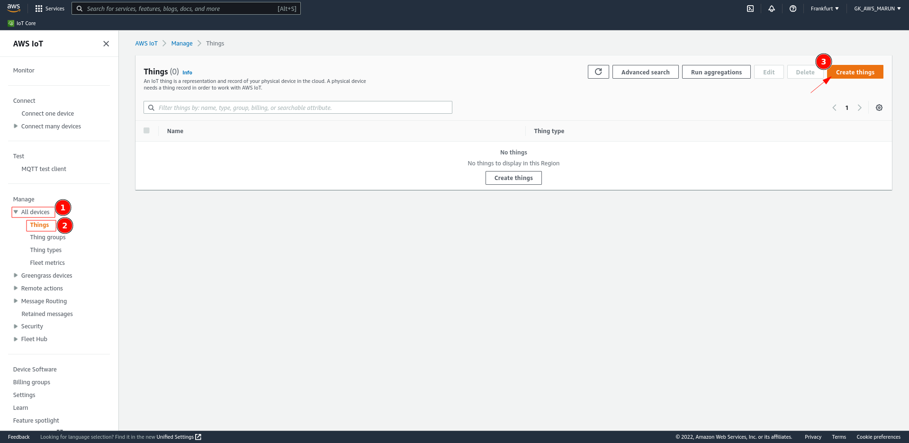

6. Select **Create single thing** if number of things to create is asked. Type a thing name, and set the device shadow as **Unnamed shadow (classic)**. Click **Next**.

   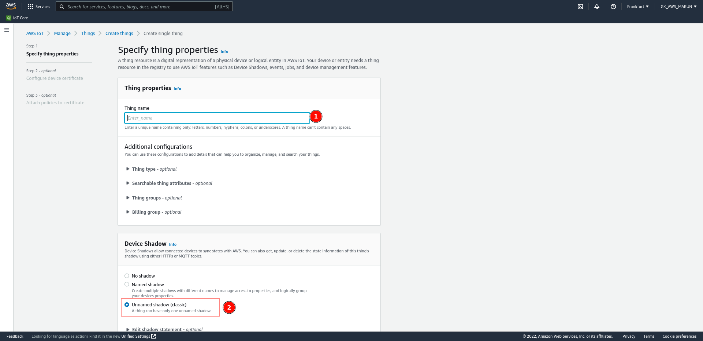

7. Select **Auto-generate a new certificate (recommended)** for the device certificate, and click **Next**.

   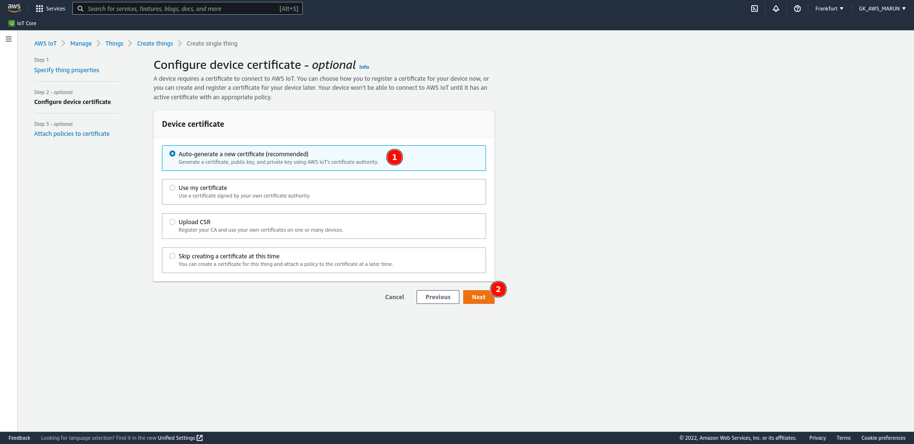

8. Select the policy you've created in the fourth step. Click **Create thing**.

   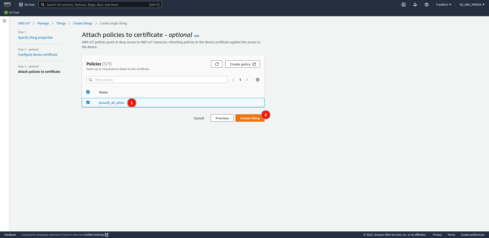 

9. Save the device certificate as `client.pem`, private key file as `user_key.pem` and root certificate as `cacert.pem`. Create a directory called `cert/` inside of the Picocell and copy these three key file into that directory.

   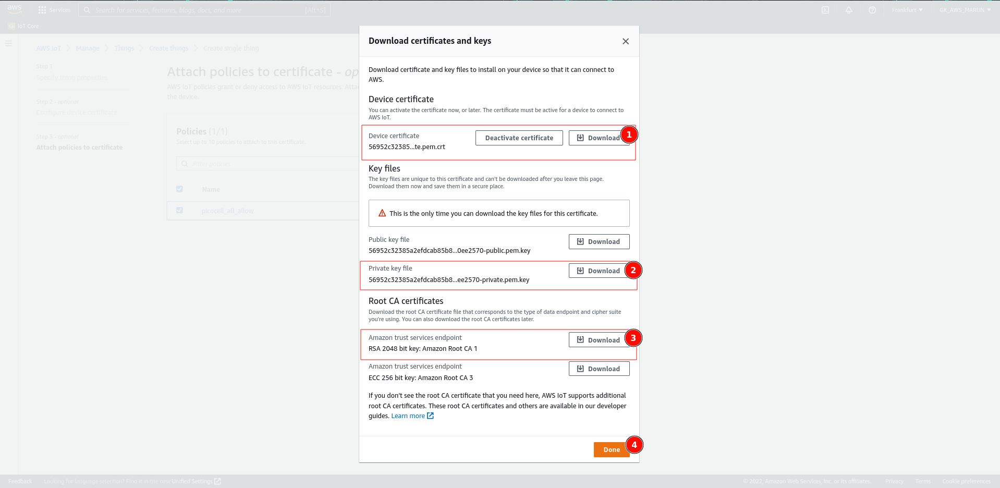

10. Now, its time to find your host address and the topic for publishing messages over MQTT. To do that, please go to the **Things** page again, and select the thing that you've created in Step 6.

    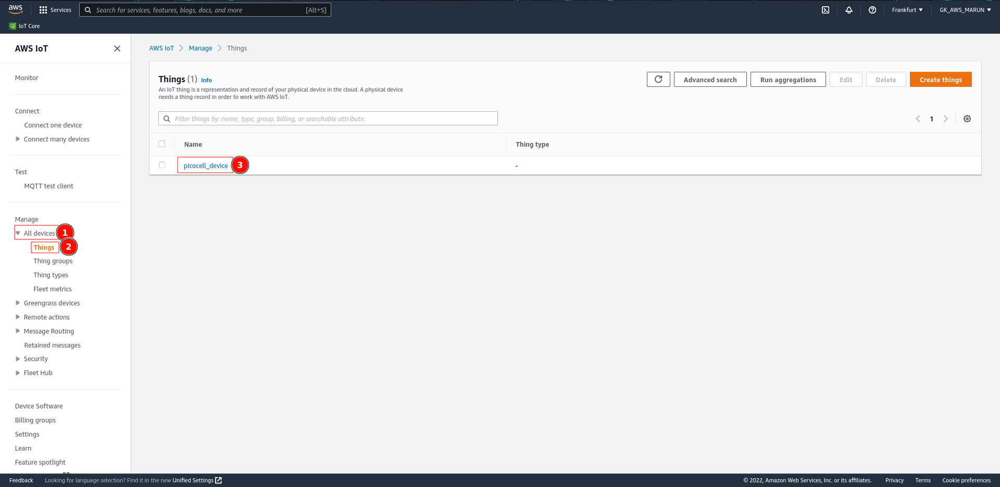

11. Select **Device Shadows** tab, and click to the **Classic Shadow**.

    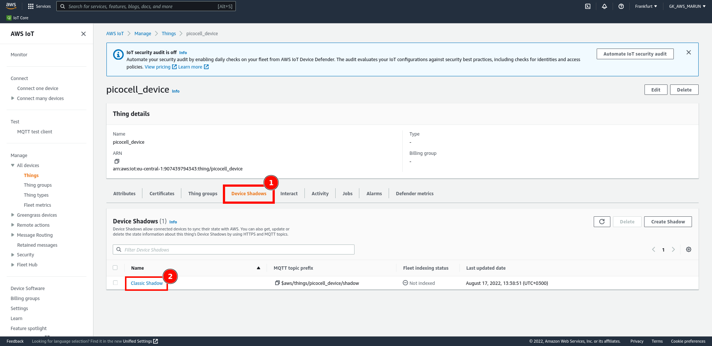

12. Follow the **MQTT Topics**, and get your host address and publishing topic name as shown in the figure below. We're going to put these informations into our `config.json` file to connect into the MQTT broker.

    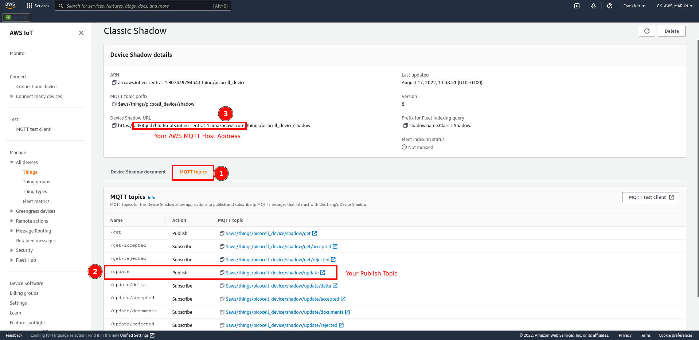

## Test

The only thing that you have to change is `config.js` according to your MQTT settings. Since AWS does not need use any user name and password settings, you need to provide your device's credential keys as we explained in Step 9. 

```json
{
    "aws": {
        "mqtts": {
            "host": "[YOUR_AWS_HOST_ADDRESS]",
            "port": 8883,
            "pub_topic": "[YOUR_AWS_PUBLISH_TOPIC]"
        }
    }
}
```

Please provide your host address starting from `https://`  and ending before `/things/...`. In our example case, the device we have created will have following `config.json` file.

```json
{
    "aws": {
        "mqtts": {
            "host": "a3k4qed7hludio-ats.iot.eu-central-1.amazonaws.com",
            "port": 8883,
            "pub_topic": "$aws/things/picocell_device/shadow/update"
        }
    }
}
```

If you want to change the message you will send, you can open the Python file containing our code and update the `PAYLOAD_JSON` variable as you wish. After finishing all the steps explained above, you can run the example code with pressing the green button on the Thonny IDE.

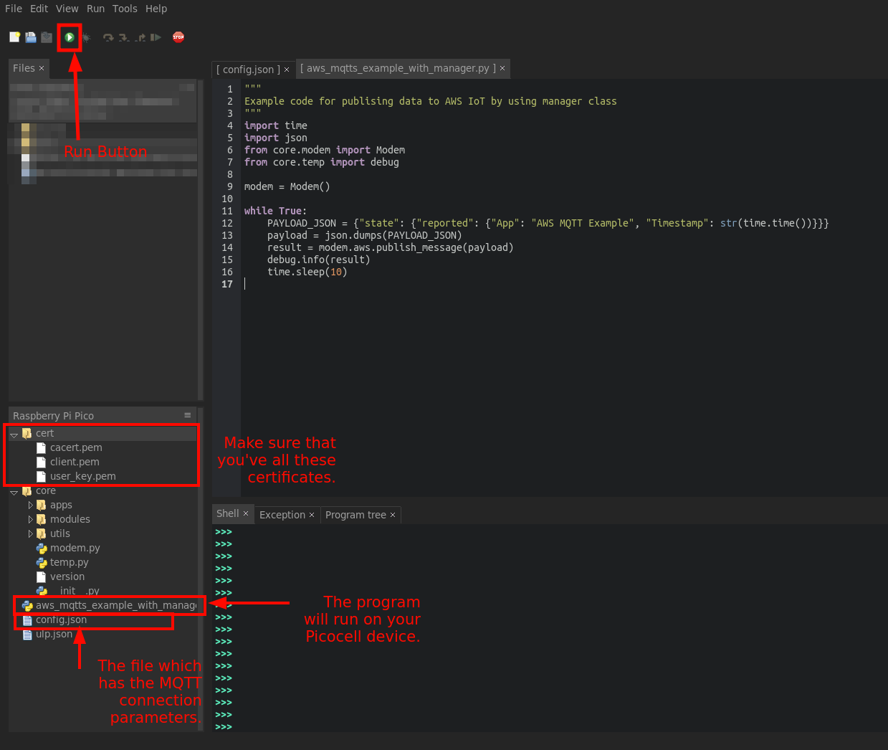

If you have successfully completed all the steps, when you run the program, you should see a log similar to the log below, and you should see the addition of `"App": "AWS MQTT Example"` in the JSON named Device Shadow state on the page we opened with step 11 in Amazon Web Services IoT Core.

```log
>>> %Run -c $EDITOR_CONTENT
MQTT: a3k4qed7hludio-ats.iot.eu-central-1.amazonaws.com 8883 $aws/things/picocell_device/shadow/update {"state": {"reported": {"App": "AWS MQTT Example", "Timestamp": "1660745219"}}}
INFO: Certificates uploaded secure storage. Deleting from file system...
INFO: Certificates deleted from file system.
INFO: Certificates found in modem.
INFO: {'interval': 0, 'status': 0}
```


## Example Code Examination

In the given sample code, we first add the libraries we will use, including our Picocell SDK. In the second part of the code, we create an object called `modem` so that we can use the features of our Picocell SDK and make MQTT connection through it. In the next stage, we publish the JSON message we created in an endless loop to the AWS IoT Core platform. We pause for ten seconds at each stage of the loop.

### Warning

*  The JSON library is important to us because the AWS IoT Core platform accepts sent messages as JSON.

## Troubleshooting
1. **I cannot connect to the broker and logs give me `MQTT: None 8883 None` information.**
It means that your `config.json` file doesn't have host and publish topic fields. Please copy the example `config.json` file given in the Test section, and replace the relevant fields without corrupting the file.
2. **I can send a JSON message, but AWS IoT Core Device Shadow state doesn't show me the message I sent.**
If you can see a log such as `INFO: {'interval': 0, 'status': 0}`, it means that your message has been sent into the host you provided. Please check your Policy settings as shown in Step 5, and configure it as "Allow all". Additionally, please check your `PAYLOAD_JSON` if it follows the AWS IoT Core's message format rules.
3. **It gives me an `Certificates couldn't find in modem!` error.**
This error can have multiple causes. The most common of these is to upload the certificate files into your Picocell module without changing the names of the certificate files correctly (as described in Step 9.). Another reason is that the installed certificate files are not installed in the `cert/` folder in the file system of your Picocell module. Please check both these conditions and try again.
4. **I'm getting a `INFO: {'interval': 0, 'status': 1}.` statement and message is not delivered.**
The fact that `status` is 1 in the information logs you receive indicates that your operation returned an error. Additionally, if you think that you have not received any additional information about the error at all, the reason for the error is that your certificate files do not allow you to login to the MQTT broker. To fix this, re-install the correct certificates in the `cert/` folder with the correct filenames. If this solution did not work, repeat all the steps in the Register and Activate AWS IoT Service section and upload your new certificate files to your Picocell device.