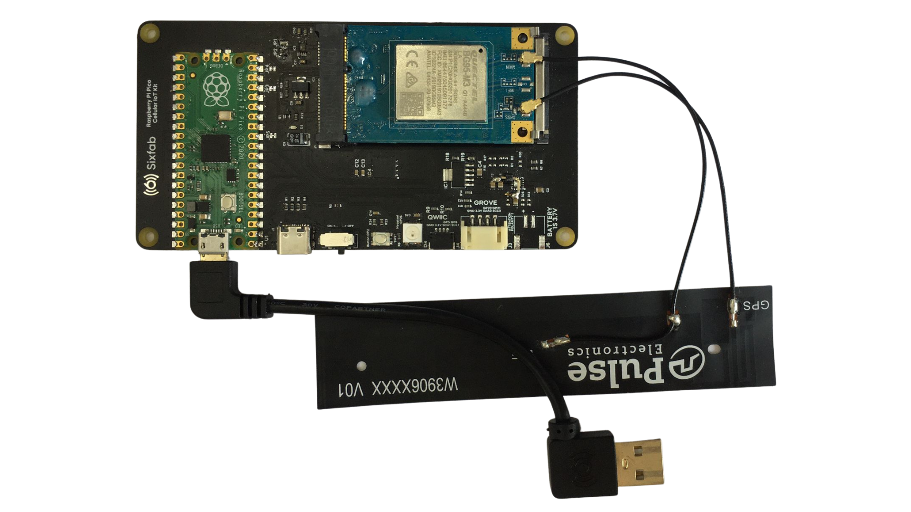

# Publishing Data to Azure IoT Hub using MQTT in Picocell

This section will lead you step by step to create a cellular connection to the Azure IoT Hub with the Picocell and MQTT protocol.

## Description

The Picocell provides all the components you will need for establishing an MQTT connection to the Azure IoT Hub. You don't need any additional hardware equipments for this example.

Getting started is pretty straight forward, first you will setup the hardware then complete the example code to start the connection. Each of the steps are mentioned in detail below.

## System Requirements

To getting started with the Picocell, first check the following requirements.

| Hardware Requirements                                        | Software Requirements |
| ------------------------------------------------------------ | --------------------- |
| - A Picocell module<br />-Quactel BG95 modem<br />- A antenna<br />- A micro USB to USB-A converter | - Thonny IDE<br />    |

## Hardware Setup

You can complete the hardware installation by following the steps below.

1. **Carefully plug your Quectel BG95 modem into the socket of your Sixfab Raspberry Pi Pico IoT Kit.**
   

2. **After installing your modem as shown in the image in step one, gently push the airborne edge with your finger and place it on the mechanical bed.**

   

3. **Connect the GPS and LTE cables of your Pulse antenna to the antenna sockets indicated in the image below.**

   

   

4. **As a final step, connect your microUSB to USB-A converter to your board as in the image below so that you can program your development board.**

   

5. **Connect the USB-A to your own computer. Check if the power switch is ON.**

## Software Setup

We have completed the hardware setup, now we will install MicroPython to our development board and the Picocell SDK. Afterwards, we're going to connect to the Azure IoT Hub's MQTT Broker with our credentials.

### Preparing Coding Environment

1. Upload MicroPython binary file into the development board's file system. You can follow the instructions on the MicroPython's website [on this link.](https://micropython.org/download/rp2-pico/)
2. Install Thonny IDE into your computer. You can follow the instructions on [its official website](https://thonny.org/).
3. Download the Picocell SDK code from [this GitHub repository](https://github.com/sixfab/picocell_python-sdk/).
4. Copy the `core` directory from the repository into the Picocell's file system.
5. Copy the file named _examples/azure/mqtt_publish.py_ to your Picocell.
6. Create a `config.json` file in the Picocell's file system.

### Register and Activate Azure IoT Hub

1. Register or login to your Azure account. You may want to follow [this tutorial](https://docs.microsoft.com/en-us/learn/modules/create-an-azure-account/) on Microsoft Azure's documentation.

2. Type **IoT Hub** onto the search bar, and choose the service which has the same name with what we wrote. Click **Create IoT Hub** button.

   

3. Select a resource group to connect your Azure IoT Hub, and give a name to your hub. Please note that you may want to see other details such as Pricing in the **Managment** tab before pressing the **Review + create** button.

4. Review the information and if everything seems OK, press **Create**. Azure is going to deploy your service. Press **Go to resource**.

5. Follow [this tutorial](https://docs.microsoft.com/en-us/azure/iot-hub/tutorial-x509-scripts) given by the Microsoft Docs until its fifth step to create test certificate files, or use your own certificates and continue to process. In this tutorial, you'll create a certificate to upload **Certificate** section in the IoT hub and verify it, and create a device with **X.509 CA Signed** option.

6. Copy the contents of the bellow certificate and save it to somewhere with a name "cacert.pem". This certificate file is the root certificate for Azure IoT Hub services.

```certificate
-----BEGIN CERTIFICATE-----
MIIDdzCCAl+gAwIBAgIEAgAAuTANBgkqhkiG9w0BAQUFADBaMQswCQYDVQQGEwJJ
RTESMBAGA1UEChMJQmFsdGltb3JlMRMwEQYDVQQLEwpDeWJlclRydXN0MSIwIAYD
VQQDExlCYWx0aW1vcmUgQ3liZXJUcnVzdCBSb290MB4XDTAwMDUxMjE4NDYwMFoX
DTI1MDUxMjIzNTkwMFowWjELMAkGA1UEBhMCSUUxEjAQBgNVBAoTCUJhbHRpbW9y
ZTETMBEGA1UECxMKQ3liZXJUcnVzdDEiMCAGA1UEAxMZQmFsdGltb3JlIEN5YmVy
VHJ1c3QgUm9vdDCCASIwDQYJKoZIhvcNAQEBBQADggEPADCCAQoCggEBAKMEuyKr
mD1X6CZymrV51Cni4eiVgLGw41uOKymaZN+hXe2wCQVt2yguzmKiYv60iNoS6zjr
IZ3AQSsBUnuId9Mcj8e6uYi1agnnc+gRQKfRzMpijS3ljwumUNKoUMMo6vWrJYeK
mpYcqWe4PwzV9/lSEy/CG9VwcPCPwBLKBsua4dnKM3p31vjsufFoREJIE9LAwqSu
XmD+tqYF/LTdB1kC1FkYmGP1pWPgkAx9XbIGevOF6uvUA65ehD5f/xXtabz5OTZy
dc93Uk3zyZAsuT3lySNTPx8kmCFcB5kpvcY67Oduhjprl3RjM71oGDHweI12v/ye
jl0qhqdNkNwnGjkCAwEAAaNFMEMwHQYDVR0OBBYEFOWdWTCCR1jMrPoIVDaGezq1
BE3wMBIGA1UdEwEB/wQIMAYBAf8CAQMwDgYDVR0PAQH/BAQDAgEGMA0GCSqGSIb3
DQEBBQUAA4IBAQCFDF2O5G9RaEIFoN27TyclhAO992T9Ldcw46QQF+vaKSm2eT92
9hkTI7gQCvlYpNRhcL0EYWoSihfVCr3FvDB81ukMJY2GQE/szKN+OMY3EU/t3Wgx
jkzSswF07r51XgdIGn9w/xZchMB5hbgF/X++ZRGjD8ACtPhSNzkE1akxehi/oCr0
Epn3o0WC4zxe9Z2etciefC7IpJ5OCBRLbf1wbWsaY71k5h+3zvDyny67G7fyUIhz
ksLi4xaNmjICq44Y3ekQEe5+NauQrz4wlHrQMz2nZQ/1/I6eYs9HRCwBXbsdtTLS
R9I4LtD+gdwyah617jzV/OeBHRnDJELqYzmp
-----END CERTIFICATE-----
```

### Upload the Certificates to Your Picocell

1. Create an empty `cert/` directory. Note that it should be somewhere else then the directory created by `certGen` script in previous section's Step 5.
2. Rename `certGenDirectory/certs/new-device.cert.pem` file to `client.pem`, and put it into the `cert/` directory you've created.
3. Rename `certGenDirectory/private/new-device.key.pem` file to `user_key.pem`, and put it into the `cert/` directory you've created.
4. Put the `cacert.pem` file that is created in previous section's Step 6 into the `cert/` directory you've created.
5. Upload this `cert/` directory to your Picocell device.

## Test

In this section, you only need to write necessary configurations into your `config.json` file. You can find the example `config.json` in README.md file of the repository, or look below.

```json
"azure": {
    "hub_name": "[YOUR_IOT_HUB_NAME]",
    "device_id": "[YOUR_DEVICE_ID]"
}
```

In our case, we're going to use a JSON such as the one in below.

```json
"azure": {
    "hub_name": "picocell",
    "device_id": "first_device"
}
```

Please check that you have a `config.json`, the example `publish_message.py` script to send data to server, and the certificates on the Picocell's file system.


Press the run button, and look to the console output. It should be something similar to this log:

```log
>>> %Run -c $EDITOR_CONTENT
INFO: Publishing data to Azure IoT Hub...
INFO: Certificates uploaded secure storage. Deleting from file system...
INFO: Certificates deleted from file system.
INFO: Certificates found in modem.
INFO: Result {'status': 0, 'response': ['OK'], 'interval': 0}
```

Now, go to your Internet browser and open the Azure IoT Hub dashboard. Select **Devices** from the sidebar, and choose the device we created for our Picocell hardware. You may see a button called **Device Twin**, press it.


This panel is a JSON-looking descriptive document to see your configurations and data about your device. The data published from the device is always saved under the **reported** property. If you cannot see your message in this Device twin, click to **Refresh** button and check it again.


## Troubleshooting

*Will be updated...*
