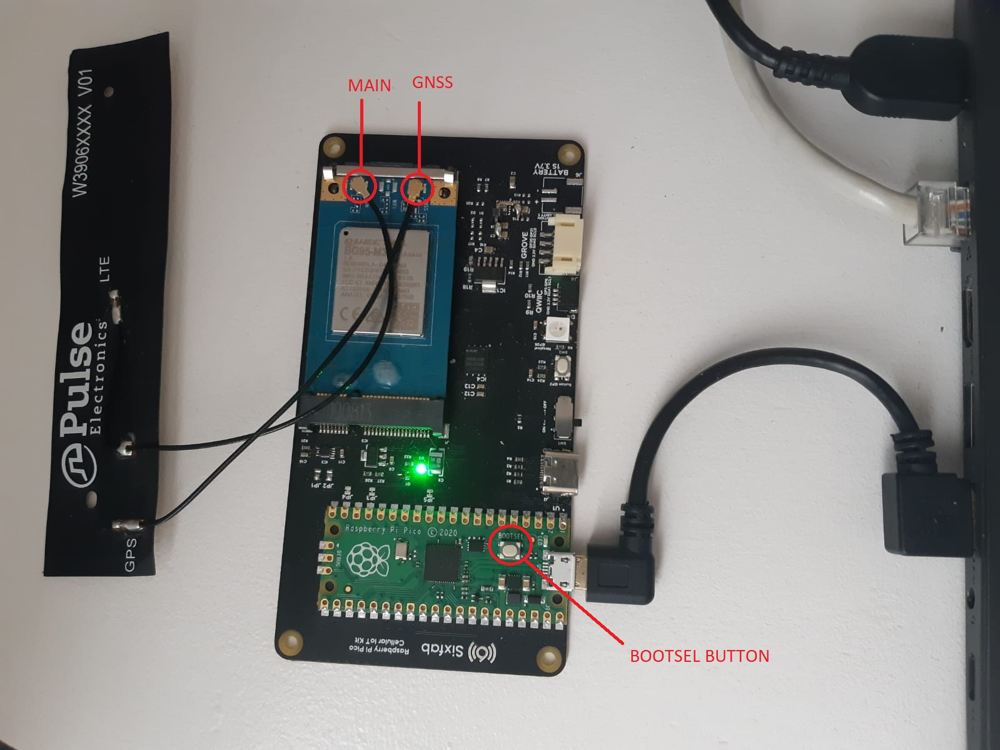
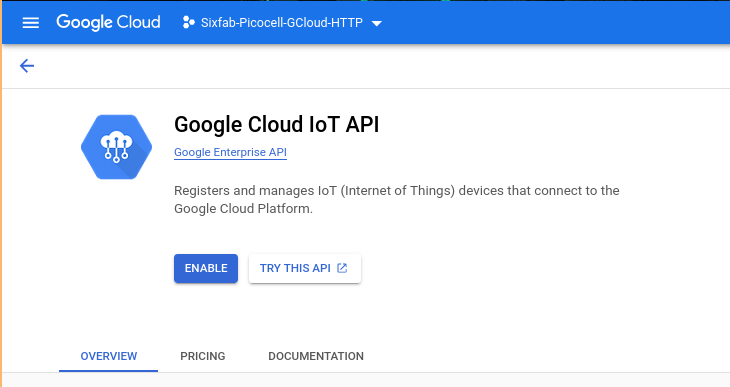
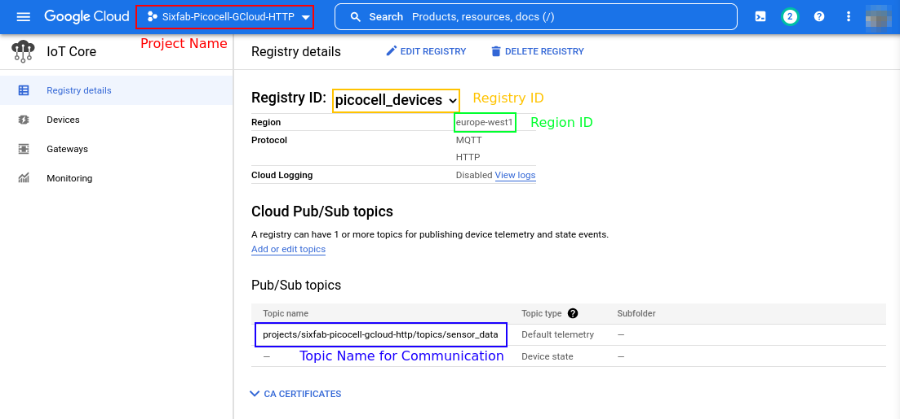
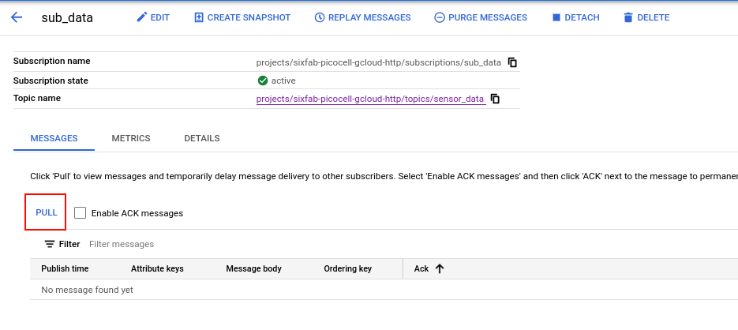
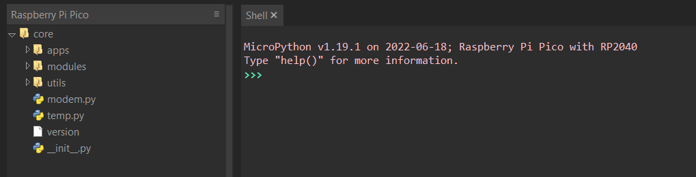
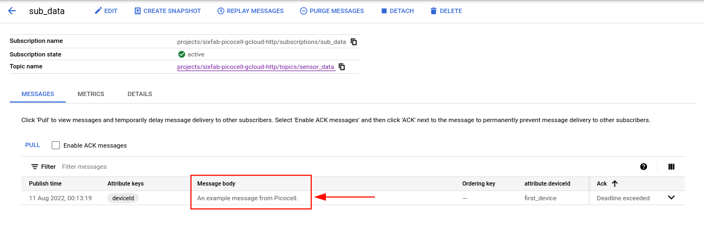

#  Picocell Google IoT Core Connection via HTTP

In this tutorial, we investigate how to use Google Cloud's IoT Core and Pub/Sub services to transfer data from Picocell devices to our Google Cloud infrastructure.

##  Description

Google Cloud is a cloud computing services platform such as Amazon's Web Services and Microsoft's Azure. Google Cloud IoT Core is a fully managed service that allows you to easily and securely connect, manage, and ingest data from millions of globally dispersed devices.

## System Requirements

### Hardware

- Picocell w/ Quectel BG95-M3 
- USB cable
- LTE - GNSS Dual u.FL Antenna  – 100mm

### Software

- MicroPython UF2 file
- Thonny IDE
- Google account 

## Hardware Setup / Preparation

1. Attach the antenna to the Quectel BG95-M3

   Make sure the right antenna is connected to the right port. Connect Quectel's main port with the antenna's LTE cable, and the GNSS port with the GPS cable.

2. Plug into the power source

   Make sure your Raspberry Pi Pico is not connected to any power sources. If it is, unplug the micro USB cable and any other cables that may be powering the board. Keep pressing the BOOTSEL button while connecting the micro USB cord (which hopefully has the other end plugged into your computer). 

   You can go to the [link](https://www.raspberrypi.com/document/microcontrollers/micropython.html) to access more information about Raspberry Pi Pico and review the installation in more detail.





## Software Setup / Preparation ##

1. Run MicroPython

   After connecting Picocell to your computer, it will be mounted as a Mass Storage Device named RPI-RP2. Drag and drop the MicroPython UF2 file (Download from the [link](https://micropython.org/download/rp2-pico/rp2-pico-latest.uf2)) onto the RPI-RP2 volume. Your Pico will reboot. You are now running MicroPython. 

   Go to the [link](https://datasheets.raspberrypi.com/pico/raspberry-pi-pico-python-sdk.pdf) to access and review the Raspberry Pi Pico Python SDK in more detail.

2. Install and run the Thony IDE

   The latest release of Thonny can be downloaded from the [link](https://thonny.org/).

3. Create project

   Sign up or log in to your account for the Google Cloud platform, then go to your Console from the [link](https://console.cloud.google.com/). To create a new project or continue with your existing project, click Select from the drop-down list at the top of the page and perform your action from the pop-up window.

> Warning: Make sure that billing is enabled for your Cloud project. Learn how to [check if billing is enabled on a project](https://cloud.google.com/billing/docs/how-to/verify-billing-enabled).

4. Enable IoT Core 

   After selecting your project, type "IoT Core" in the search box at the top of the page and continue by selecting the IoT Core API that enables the connection between Picocell and Google Cloud. It will redirect you to Google Cloud IoT API's description and overview page. Click the Enable button.

   


5. Create Registry 

   Clicking and enabling the product will redirect you to its dashboard. The dashboard consists of a table for registries. A registry should be created in which the settings to be made for Picocell are saved. If you have just activated the API, your table does not have a registry. Also, to send similar data with similar configurations with one or more devices, you must create a separate register and assign each device to that registry.

   Click **Create Registry** next to the Registries title, and fill out the form. Since the registry ID and the region will be used for communication purposes, you may need to save them somewhere. In the Cloud Pub/Sub topics section, open the drop-down list and click **Create a topic** link. Type a topic ID, and save it to somewhere as well as others. You don't need to change any other setting in this panel.

   After coming back to the registry creation form, click on the **Show Advanced Options** link, and make sure that HTTP is selected in the Protocols section. Press **Create** button to save your registry.

   After the registry is saved, the dashboard will be as shown below.

   


6. Create an RSA-256 X-509 Certificate Pair

   In this tutorial, we use `openssl` tool to create a private and public key pair which is used for proving our devices to log into the Google Cloud. Open a terminal window and run the following command to create an RS256 key:

```bash
~$ openssl req -x509 -newkey rsa:2048 -keyout rsa_private.pem -nodes -out rsa_cert.pem -subj "/CN=unused"
```

​	This command creates two files:

* `rsa_private.pem`: The file that creates the password to login to the Google Cloud API.
* `rsa_cert.pem`: Public key file to give it as a "recognizing certificate" to understand if our private key matches with the device's public key.

7. Create Devices

   Please go to the **Devices** page by selecting it on the Dashboard's sidebar. Select **Create a device** link from the top of the page. Then, select a device ID and click on the **Communication**, **Cloud Logging**, **Authentication** link. In these advanced settings, go to the **Authentication** (optional) section and select the **Upload** radio button. Choose **RS256_X509** from the dropdown list and upload the `rsa_private.pem` file that we have created one section before. After that, click **Create**.

   Do this step for each device you want to connect to your Google Cloud. After completing the device creation step, return to the **Registry details** page and click on the topic name that is shown with a dark blue color in the previous Figure. It has to redirect you to Pub/Sub service.

> Note: If the redirection process didn't do its job, just search for "Pub/Sub" on the search bar, and click the corresponding service. Select the topic name in the service's dashboard. It is the same page that you should redirect.

8. Create a subscription and see messages

   Click on the blue link that says **Create Subscription** and fill in the details. The subscription will be used to see the messages that Picocell sent. Make sure that you've selected the **Pull** delivery type. All other settings are optional for this tutorial. To see new-come messages, you have to click the **Pull** button each time.



9. Download Github Repository

   Download the repo from the [link](https://github.com/sixfab/picocell_python-sdk/tree/dev) and save the core file in the repo to Raspberry Pi Pico. First, open the downloaded file in Thonny IDE under This Computer, then, right-click on the **core** file, and upload it into Pico with `Upload to /`.




10. Create JSON Web Token

    A JSON Web Token is a JSON file that has initialization time and expiration time with the project ID of your Google Cloud project. It is encrypted with the private key that we have created before. You can use this GitHub repository and its `JWT_Creator.py` file to create a token and put it into the Picocell code.

    ```bash
    ~$ git clone git@github.com:electricalgorithm/JWT-Creator.git
    ~$ cd JWT-Creator
    ~$ pip install -r requirements.txt
    ```

    Once you've installed the script, run it and give your Google Cloud project id with `-i` flag, your private RSA256 key with `-p` key, and algorithm's name with `-a`. In this tutorial, you should type `RS256` for the encryption algorithm.

    ```bash
    ~$ python JWT_Creator.py -i [your_project_id] -p [your_private_key_address] -a [encrpytion_algorithm]
    ```

    It returns you the JSON web token directly. Copy it carefully to paste it to the JSON_WEB_TOKEN variable in your code. 


## Test

After all these steps you are almost ready to run the `gcloud_http_example.py` example in the **example** file in *Picocell Python SDK*. Before running the example, you need to make changes to some places in the example. You should replace the relevant places in the `GCloudAccount` object with the information you created in the *Software Setup* section.

```python
GCloudAccount = {
    'project_id': '[PROJECT_ID_IN_GCLOUD]',
    'region': '[REGION_IN_GCLOUD]',
    'registry_id': '[REGISTRY_ID_OF_DEVICE]',
    'device_id': '[DEVICE_ID]',
    'jwt': '[JSON_WEB_TOKEN]'
}
```

Save the message that you want to send in the `DATA_TO_POST` object.

```python
DATA_TO_POST = "An example message from Picocell."
```

After completing all these steps, when you run the code, the message you want to send will be successfully transmitted as shown in the figure. The **output** you get in the code should look like this:

```python
INFO: Set server URL: {'response':'AT+QHTTPURL=37,5\r\r\nCONNECT\r\n', 'status': 0}
INFO: Send registration request: {'response': '\r\nOK\r\n', 'status': 0}
INFO: Send the data: {'response': '\r\nOK\r\n', 'status': 0}
```





## Example Code Examination

As the first start, we have to import some classes to accomplish some tasks. You can see the module's names, and their usages in our code.

* `Modem` from *core.modem*: It is the base element for Picocell projects. You have to import it to use any functionality in the SDK.
* `Debug` from *core.utils.debug*: It is used for printing texts into the shell prompt, with predefined levels of debug such as `INFO`, `ERROR` and etc.
* `Status` from *core.utils.status*: It is useful to check if a command returned `SUCCESS` condition or not. It is not necessary, however, it is good to use.
* `ubinascii`: It is used to convert between binary and ASCII.
* `time`: It is a built-in library for MicroPython projects, and we're going to use it to wait some amount of time to wait for the modem to be ready.

```python
import json
import time
import ubinascii
from core.modem import Modem
from core.utils.debug import Debug
from core.utils.status import Status
```

Following the code, there are objects where Google Cloud information and message are kept.

```python
# Complete these informations to connect to your Google Cloud services.
GCloudAccount = {
    'project_id': '[PROJECT_ID_IN_GCLOUD]',
    'region': '[REGION_IN_GCLOUD]',
    'registry_id': '[REGISTRY_ID_OF_DEVICE]',
    'device_id': '[DEVICE_ID]',
    'jwt': '[JSON_WEB_TOKEN]'
}
```

```python
# Put a message here to send it to the topic.
DATA_TO_POST = "This message is an example from Picocell SDK."
```

Google Cloud information is converted into a format suitable for Picocell and network settings are made.

```python
if __name__ == "__main__":
    # This server details does not need to be changed.
    GCloudServer = {
        'HOST': 'https://cloudiotdevice.googleapis.com',
        'QUERY': '/v1/projects/' + GCloudAccount['project_id'] + \
                 '/locations/' + GCloudAccount['region'] + \
                 '/registries/' + GCloudAccount['registry_id'] + \
                 '/devices/' + GCloudAccount['device_id'],
        'QUERY_EXTRA_GET': '/config?local_version=1',
        'QUERY_EXTRA_POST': ':publishEvent'
    }

    # Initialize the instances for the Picocell SDK.
    modem = Modem()
    debug = Debug()

    # Send APN details.
    modem.network.set_apn()

    # Check the network registration.
    result = modem.network.check_network_registration()
    if result["status"] != Status.SUCCESS:
        debug.error("Could not connected to the cellular network.")

    # Set the first HTTP context.
    modem.http.set_context_id()

    # Activate PDP.
    modem.network.deactivate_pdp_context()
    modem.network.activate_pdp_context()
```

Finally, the URL is set and the headers are created for the GET and POST request, and requests are made.

```python
 # Set server URL.
    debug.info("Set server URL: ", modem.http.set_server_url(GCloudServer['HOST']))

    # Construct the header for the request to register the device.
    # It is needed before publishing a message.
    HEADER = "GET " + GCloudServer['QUERY'] + GCloudServer['QUERY_EXTRA_GET'] + " HTTP/1.1\n" + \
                "Host: " + GCloudServer['HOST'][8:] + "\n" + \
                "Content-Type: text/plain\n" + \
                "Content-Length: 0\n" + \
                "Authorization: Bearer " + GCloudAccount['jwt'] + "\n" + \
                "\n\n"

    # Send the GET request with given header.
    debug.info("Send registration request: ", modem.http.get(data=HEADER, header_mode=1))

    # Wait for the modem to be ready.
    time.sleep(3)

    # Convert the message from ASCII to base64, and put it to
    # a JSON with 'binary_data' field.
    data_in_base64 = ubinascii.b2a_base64(DATA_TO_POST)
    data_post_dict = {'binary_data': data_in_base64[0:-1]}
    data_post_json = json.dumps(data_post_dict)

    # Construct the header for the request to publish the message.
    HEADER = "POST " + GCloudServer['QUERY'] + GCloudServer['QUERY_EXTRA_POST'] + " HTTP/1.1\n" + \
                "Host: " + GCloudServer['HOST'][8:] + "\n" + \
                "Content-Type: application/json\n" + \
                "Authorization: Bearer " + GCloudAccount['jwt'] + "\n" + \
                "Content-Length: " + str(len(data_post_json) + 1) + "\n" + \
                "\n\n"

    # Send the POST request with given header.
    debug.info("Send the data: ", modem.http.post(data=HEADER+data_post_json, header_mode=1))
```

