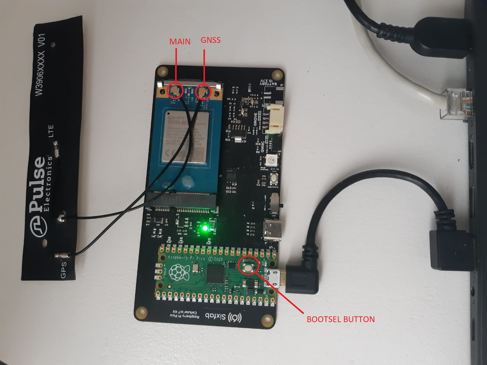

# Google Sheets API Usage with Picocell

In this document, using Google Sheets app of Picocell will be performed.

## Description

Google Sheets is a web-based application that enables users to create, update and modify spreadsheets and share the data online in real time. With using its own API, it can be used as online database for various Internet of Things (IoT) and other projects. 

## System Requirements

### Hardware

- Picocell w/ Quectel BG95-M3 
- USB cable
- LTE - GNSS Dual u.FL Antenna  – 100mm

### Software

- MicroPython UF2 file

- Thonny IDE

- Google account

  

## Hardware Setup / Preparation

1. Attach the antenna to the Quectel BG95-M3

   Make sure the right antenna is connected to the right port. Connect Quectel's main port with the antenna's LTE cable, and the GNSS port with the GPS cable.

2. Plug into the power source

   Make sure your Raspberry Pi Pico is not connected to any power sources. If it is, unplug the micro USB cable and any other cables that may be powering the board. Keep pressing the BOOTSEL button while connecting the micro USB cord (which hopefully has the other end plugged into your computer). 

   You can go to the [link](https://www.raspberrypi.com/document/microcontrollers/micropython.html) to access more information about Raspberry Pi Pico and review the installation in more detail.




## Software Setup / Preparation ##

1. Run MicroPython

   After connecting Picocell to your computer, it will be mounted as a Mass Storage Device named RPI-RP2. Drag and drop the MicroPython UF2 file (Download from the [link](https://micropython.org/download/rp2-pico/rp2-pico-latest.uf2)) onto the RPI-RP2 volume. Your Pico will reboot. You are now running MicroPython. 

   To access and review the Raspberry Pi Pico Python SDK in more detail, go to the [link](https://datasheets.raspberrypi.com/pico/raspberry-pi-pico-python-sdk.pdf).

2. Install and run the Thony IDE

   The latest release of Thonny can be downloaded from the [link](https://thonny.org/).

3. Download Github Repository

   Download the repo from the [link](https://github.com/sixfab/picocell_python-sdk) and save the core file in the repo to Raspberry Pi Pico. To do this, first, open the downloaded file in Thonny IDE under *This Computer* and right-click on the core file, and upload it into Pico with "Upload to /".

4. Login to Google Cloud Console

   Login to Google Cloud Console with your Google account from [the login page](https://console.cloud.google.com).

5. Create a New Project

   Create a project and give a name to it.


6. Enable Google Sheets API and Create Credentials

   Select your project at first. Then, select "APIs & Services" section. 


   In the "OAuth consent screen" section, select "External" and create it.


   Fill the boxes numbered 1,2 and 3 and continue. You have to fill 2 and 3 numbered boxes with your existing Gmail address.


   Press "SAVE AND CONTINUE"


   Add test user to access to the app. It should be filled with the existing Gmail address.


   In the "Enabled APIs & services" section, press 2 numbered button.


   Then, enable the Google Sheets API.


   Press Create Credentials box.


   Select API as "Google Sheets API" and User data section. After that, press "Save & Continue" in scopes part with no extra operation.


   Select application type as "Web application". Fill the name box with your desired client name. Add "http://localhost" URL to "Authorized redirect URLs" section and create it.


   You can download client informations using download button. In downloaded file, client id and client secret keys can be found. They will be used in next operations.


   Press 1, 2 and 3 numbered buttons respectively and create an API key. API key will be used in next operations.


8. Create a Google Sheets document

   Login to Google Sheets page from this [link](https://docs.google.com/spreadsheets/) and create a Google Sheets document.


   In the image below, you can get the spreadsheet id from 1 numbered part of the url. The URL format: "https://docs.google.com/spreadsheets/d/[SPREADSHEET_ID]". Spreadsheet id will be used in next operations

   Also you can add a new sheet to document using 2 numbered button and change the name of the sheet using 3 numbered button. Sheet name will be used in the next operations.


9. Create Authorization Token

   - Fill the "[CLIENT_ID]" part of this url and search it on your browser.
   ```
   https://accounts.google.com/o/oauth2/auth?client_id=[CLIENT_ID]&redirect_uri=http://localhost&response_type=code&scope=https://www.googleapis.com/auth/drive&access_type=offline
   ```
   - Choose your Google account and accept what appears next.

   - After allowing of accessing to your Google account, a blank page will be appeared. Copy the URL of the page and pick the Authorization Code from it. URL format is:

   ```
   http://localhost/?code=[AUTHORIZATION_CODE]&scope=https://www.googleapis.com/auth/drive
   ```

   - After getting the Authorization Code, you should attain the Refresh Token. There is 2 way to do this.

      1. Make a curl request with this form below. Do not forget to fill the [AUTHORIZATION_CODE], [CLIENT_ID] and [CLIENT_SECRET] parts.
      ```
      curl --request POST --data "code=[AUTHORIZATION_CODE]&client_id=[CLIENT_ID]&client_secret=[CLIENT_SECRET]&redirect_uri=http://localhost&grant_type=authorization_code" https://oauth2.googleapis.com/token
      ```

      2. Make a post request with this form below. You can use an API Platform to do this. Do not forget to fill the [AUTHORIZATION_CODE], [CLIENT_ID] and [CLIENT_SECRET] parts.
      
      ```
      https://oauth2.googleapis.com/token?code=[AUTHORIZATION_CODE]&client_id=[CLIENT_ID]&client_secret=[CLIENT_SECRET]&redirect_uri=http://localhost&grant_type=authorization_code
      ```

   - Finally, you attain the Refresh Token. It will be used in the next operations.


## Test

Create the `config.json` file for the example as shown below and use the informations you saved before.

```
{
    "google_sheets": {
        "api_key": "[API_KEY]",
        "spreadsheetId": "[SPREADSHEET_ID]",
        "sheet":"[SHEET_NAME]",
        "client_id": "[CLIENT_ID]",
        "client_secret": "[CLIENT_SECRET]",
        "refresh_token": "[REFRESH_TOKEN]"
    }
}
```