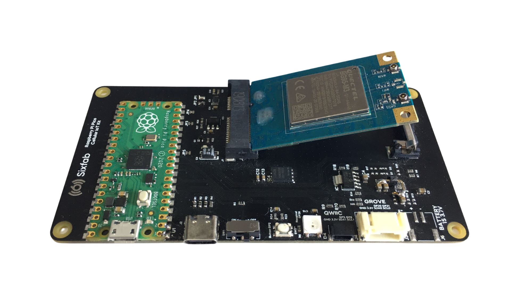
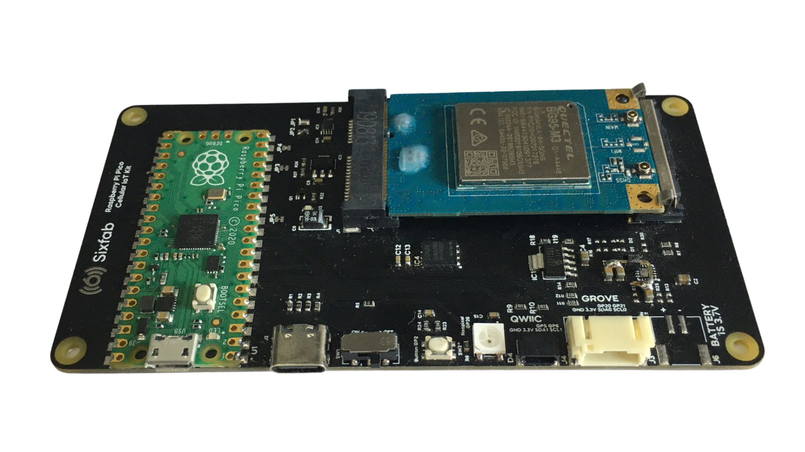
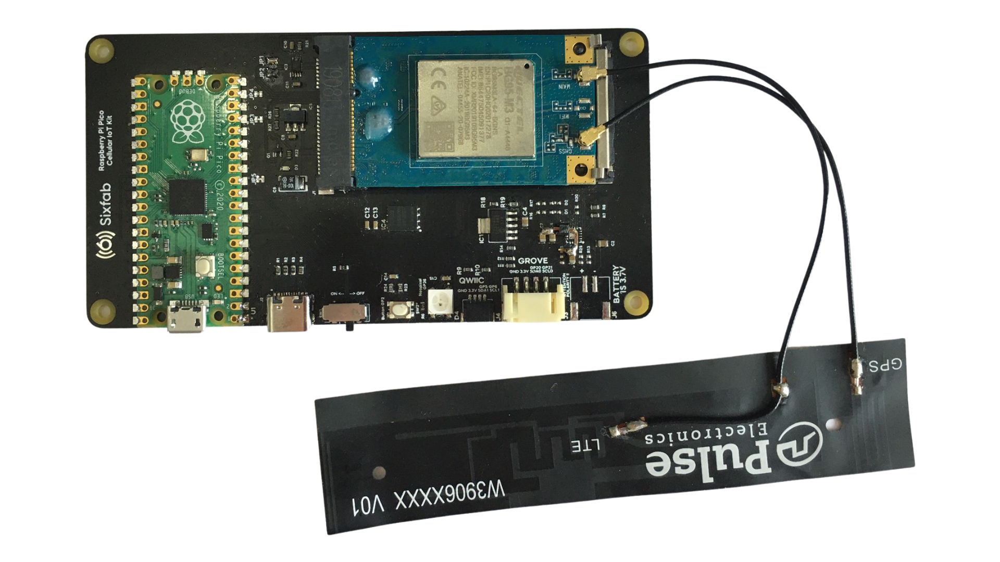

# Picocell Sending GPS Data to a Web Server via HTTP

This section will lead you step by step to create a GPS tracker with the Picocell and HTTP protocol. In the tutorial, we choose [webhook.site](https://webhook.site) as the web server to send our GPS data.

## Description

The Picocell provides all the components you will need for establishing a GPS and a HTTP connection. You don't need any additional hardware equipments for this example. Getting started is pretty straight forward, first you will setup the hardware then complete the example code to start the connection. Each of the steps are mentioned in detail below.

## System Requirements

To getting started with the Picocell, first check the following requirements.

| Hardware Requirements                                        | Software Requirements |
| ------------------------------------------------------------ | --------------------- |
| - A Picocell module<br />-Quactel BG95 modem<br />- A antenna<br />- A micro USB to USB-A converter | - Thonny IDE          |

## Hardware Setup

You can complete the hardware installation by following the steps below.

1. **Carefully plug your Quectel BG95 modem into the socket of your Sixfab Raspberry Pi Pico IoT Kit.**
   

2. **After installing your modem as shown in the image in step one, gently push the airborne edge with your finger and place it on the mechanical bed.**

   

3. **Connect the GPS and LTE cables of your Pulse antenna to the antenna sockets indicated in the image below.**

   

   

4. **As a final step, connect your microUSB to USB-A converter to your board as in the image below so that you can program your development board.**

   

5. **Connect the USB-A to your own computer. Check if the power switch is ON.**

## Software Setup

We have completed the hardware setup, now we will install MicroPython to our development board and the Picocell SDK. Afterwards, we're going to connect to the [webhook.site](https://webhook.site) using HTTP.

### Preparing Coding Environment

1. Upload MicroPython binary file into the development board's file system. You can follow the instructions on the MicroPython's website [on this link.](https://micropython.org/download/rp2-pico/)
2. Install Thonny IDE into your computer. You can follow the instructions on [its official website](https://thonny.org/).
3. Download the Picocell SDK code from [this GitHub repository](https://github.com/sixfab/picocell_python-sdk/).
4. Copy the `core` directory from the repository into the Picocell's file system.
5. Copy the file named `gps_example.py` to your Picocell.
6. Create a `config.json` file in the Picocell's file system.

### Preparing the Webhook.site

Open the [webhook.site](https://webhook.site) link in your host machine's browser. You will see a unique URL that is prepared for you. Using the figure below, you can find your unique address easily. Please note that, all the requests that is send into your unique address will be shown on the sidebar. Copy this web server URL and put it to `config.json` file as described in Test section.


## Test

The only thing that you have to change is `config.js` according to HTTP server details. Since Webhook.site does not need use any user name and password settings, we will only provide the host address. 

```json
{
    "https":{
        "server":"[HTTP_SERVER]"
    }
}
```

Please provide your host address  which is shown in the Step 1. In our example case, the `config.json` file we will be using as follows.

```json
{
    "https": {
        "server": "https://webhook.site/87b81633-e114-4b15-a3e5-04f141a68afa"
    }
}
```

After finishing all the steps explained above, you can run the example code with pressing the green button on the Thonny IDE.


If you have successfully completed all the steps, when you run the program, you should see a log similar to the log below, and you should see the new POST request in your Webhook.site dashboard.

```log
>>> %Run -c $EDITOR_CONTENT
INFO: Set the GNSS prior mode:  {'response': 'AT+QGPSCFG="priority",0\r\r\nOK\r\n', 'status': 0}
INFO: Turn on GPS:  {'response': 'AT+QGPS=1,3,0,1\r\r\nOK\r\n', 'status': 0}
INFO: GPS has been fixed. Getting location data...
INFO: Set the WWAN prior mode:  {'response': 'AT+QGPSCFG="priority",1\r\r\nOK\r\n', 'status': 0}
INFO: Turn off GPS:  {'response': 'AT+QGPSEND\r\r\nOK\r\n', 'status': 0}
INFO: The GPS data is sent: {"lat": "41°8'5", "hdop": "1.5", "alt": "167.5", "fix": "2", "lon": "41°8'5", "cog": "0.00", "spd": "0.0", "date": "220822", "utc": "212602.000"}
INFO: Set the GNSS prior mode:  {'response': '\r\n+QHTTPPOST: 0,200\r\nAT+QGPSCFG="priority",0\r\r\nOK\r\n', 'status': 0}
```


## Example Code Examination

In the given sample code, we first add the libraries we will use, including our Picocell SDK. In the second part of the code, we have prepared our Picocell device to send a HTTP request into a web server that is given in `config.json` file. After the preparation of HTTP connection, we try to fix the GPS location and post-process the data came from the modem. As a last step, we send our GPS data into the server with POST request.

## Troubleshooting

1. **I'm getting `+CME ERROR: 516` and cannot continue to post-processing of GPS data.**

   This error means that your modem couldn't fixed the location. Be sure that you're trying to connect GPS in outdoor, or attach a better antenna to connect easier.

2. **I'm getting `+CME ERROR: 504` but everything seems fine.**

   This error provides you an information about an ongoing process on the modem with GPS. You can ignore it and continue to your own process. It is possible to exit the ongoing job, and restart your code.

### Warning

For future troubleshooting, you may want to refer to `+CME ERROR` codes and their meanings using Quectel's BG95 GNSS Module Manual, and in the section of "Summary of Error Codes".
