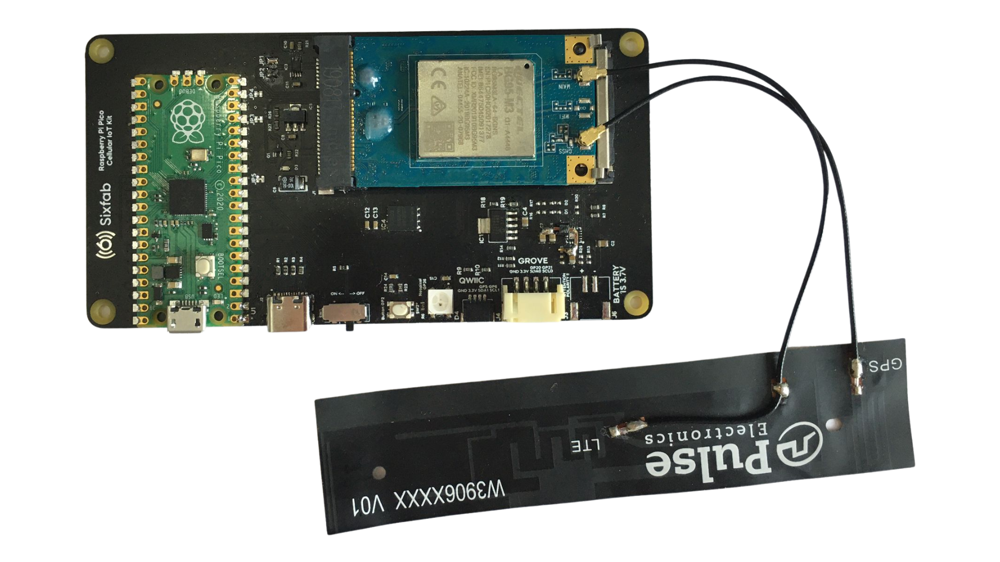
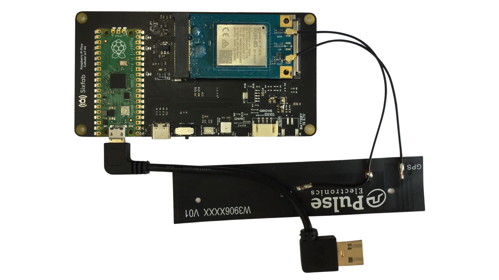
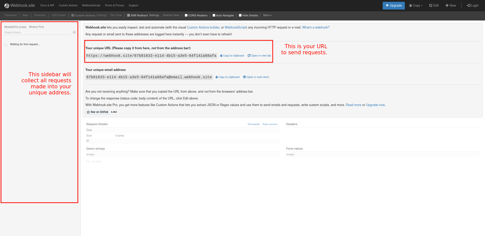
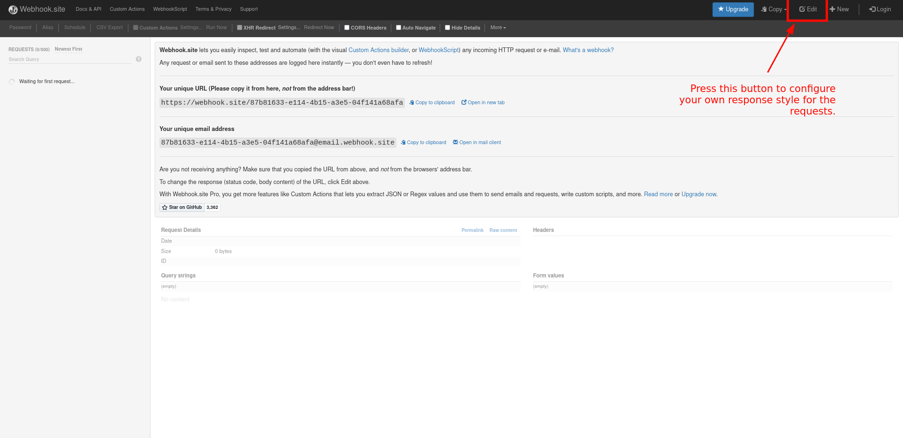
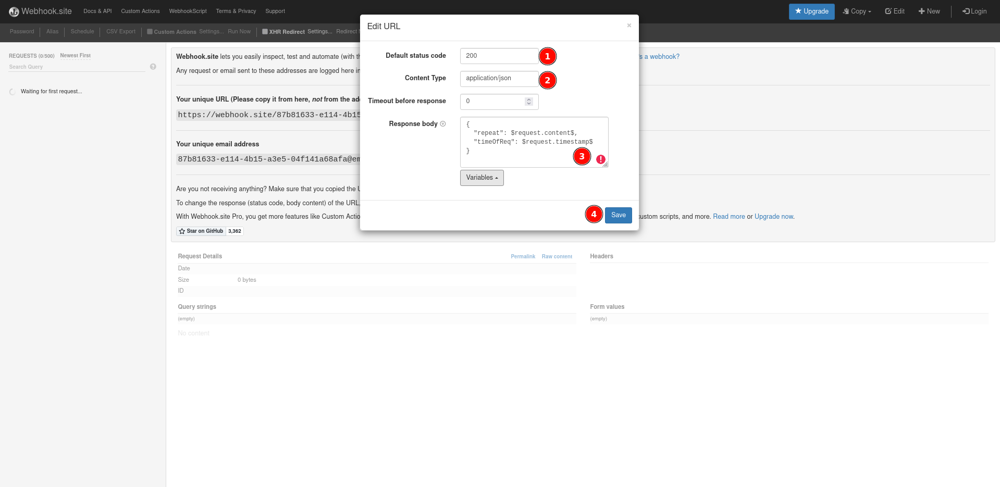
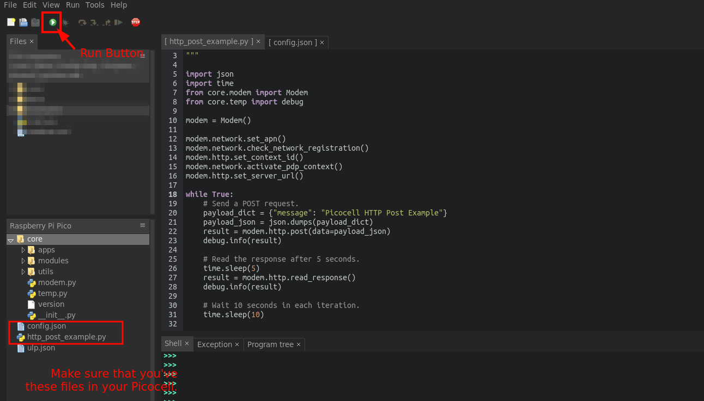
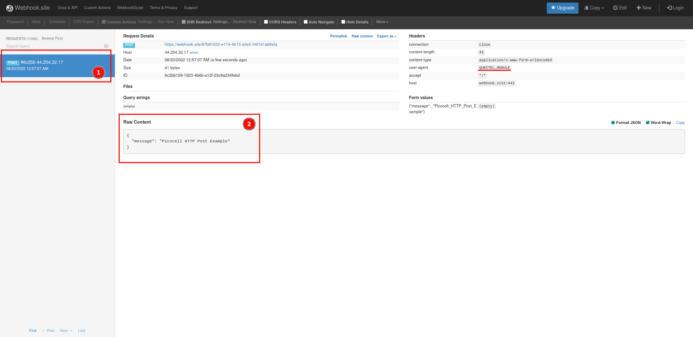

# Picocell POST Request to a Web Server using HTTP

This section will lead you step by step to create a cellular connection to the a web server with the Picocell and HTTP protocol. In the tutorial, we choose [webhook.site](https://webhook.site) as the web server to test our requests.

## Description

The Picocell provides all the components you will need for establishing an HTTP connection to a web server. You don't need any additional hardware equipments for this example. Getting started is pretty straight forward, first you will setup the hardware then complete the example code to start the connection. Each of the steps are mentioned in detail below.

## System Requirements

To getting started with the Picocell, first check the following requirements.

| Hardware Requirements                                        | Software Requirements |
| ------------------------------------------------------------ | --------------------- |
| - A Picocell module<br />-Quactel BG95 modem<br />- A antenna<br />- A micro USB to USB-A converter | - Thonny IDE          |

## Hardware Setup

You can complete the hardware installation by following the steps below.

1. **Carefully plug your Quectel BG95 modem into the socket of your Sixfab Raspberry Pi Pico IoT Kit.**
   

2. **After installing your modem as shown in the image in step one, gently push the airborne edge with your finger and place it on the mechanical bed.**

   

3. **Connect the GPS and LTE cables of your Pulse antenna to the antenna sockets indicated in the image below.**

   

   

4. **As a final step, connect your microUSB to USB-A converter to your board as in the image below so that you can program your development board.**

   

5. **Connect the USB-A to your own computer. Check if the power switch is ON.**

## Software Setup

We have completed the hardware setup, now we will install MicroPython to our development board and the Picocell SDK. Afterwards, we're going to connect to the [webhook.site](https://webhook.site) using HTTP.

### Preparing Coding Environment

1. Upload MicroPython binary file into the development board's file system. You can follow the instructions on the MicroPython's website [on this link.](https://micropython.org/download/rp2-pico/)
2. Install Thonny IDE into your computer. You can follow the instructions on [its official website](https://thonny.org/).
3. Download the Picocell SDK code from [this GitHub repository](https://github.com/sixfab/picocell_python-sdk/).
4. Copy the `core` directory from the repository into the Picocell's file system.
5. Copy the file named `http_post_example.py` to your Picocell.
6. Create a `config.json` file in the Picocell's file system.

### Preparing the Webhook.site

1. First of all, open the [webhook.site](https://webhook.site) link in your host machine's browser. You will see a unique URL that is prepared for you. Using the figure below, you can find your unique address easily. Please note that, all the requests that is send into your unique address will be shown on the sidebar.

   

2. Since our example also reads the response of the request, we may need to create a special one to understand if Picocell gets it correctly. Please click **Edit** button on the right side of the menu, and there has to be new pop-up panel about editing the response.

   

4. **Status Code** is a number determined by the standards and successful message reception is expressed by the number 200. **Content Type** is used to specify the type of message you want to be returned. It can take "text/plain" if a plain text is to be returned, and "application/json" if a JSON file is to be returned. The **Response Body** is the response you want it to return. In our example, we wanted to return a success message and report the time of the request to the server. After preparing your own custom response, click **Save**.

   

## Test

The only thing that you have to change is `config.js` according to HTTP server details. Since Webhook.site does not need use any user name and password settings, we will only provide the host address. 

```json
{
    "https":{
        "server":"[HTTP_SERVER]"
    },
}
```

Please provide your host address  which is shown in the Step 1. In our example case, the `config.json` file we will be using as follows.

```json
{
    "https":{
        "server":"https://webhook.site/87b81633-e114-4b15-a3e5-04f141a68afa"
    },
}
```

After finishing all the steps explained above, you can run the example code with pressing the green button on the Thonny IDE.



If you have successfully completed all the steps, when you run the program, you should see a log similar to the log below, and you should see the new POST request in your Webhook.site dashboard.

```log
>>> %Run -c $EDITOR_CONTENT
INFO: {'response': '\r\nOK\r\n', 'status': 0}
INFO: {'response': '\r\n+QHTTPPOST: 0,200\r\nAT+QHTTPREAD=60\r\r\nCONNECT\r\n{\r\n  "repeat": {"message": "Picocell HTTP Post Example"},\r\n  "timeOfReq": 1660946227\r\n}\r\nOK\r\n\r\n+QHTTPREAD: 0\r\n', 'status': 0}
```



### Warning

* You have to see your own custom response message on the second line of terminal output. In our example, it's clear that we get `{\r\n  "repeat": {"message": "Picocell HTTP Post Example"},\r\n  "timeOfReq": 1660946227\r\n}` from the server. Please check if you've successfully got your response message.

## Example Code Examination

In the given sample code, we first add the libraries we will use, including our Picocell SDK. In the second part of the code, we create an object called `modem` so that we can use the features of our Picocell SDK and send a POST request  through it. After the creation of Picocell modem, we prepare our HTTP connection and set necessary configurations. In the infinite loop, we send get requests and read their responses.

## Troubleshooting

1. **I'm getting `+CME ERROR: 703` error when reading the response.**

   Please increase the sleeping time before asking the Picocell to read response. It should be solved.

2. **I'm getting `+CME ERROR: 712` error while sending a POST request.**

   This error described as wrong or empty URL setting for the host. Please check your `config.json` file and put the proper URL which includes "https://" and its query.

### Warning

For future troubleshooting, you may want to refer to `+CME ERROR` codes and their meanings using [Picocell's `http.py` file](https://github.com/sixfab/picocell_python-sdk/blob/dev/core/modules/http.py#L4).
