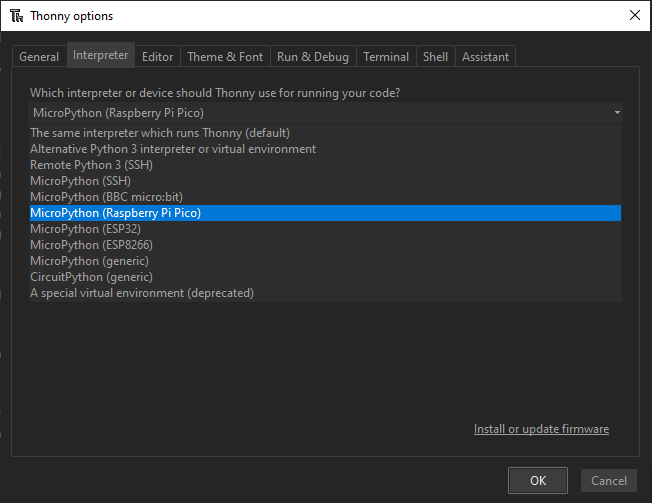
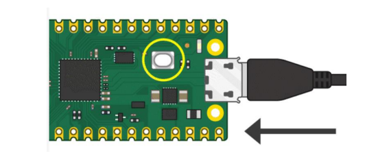
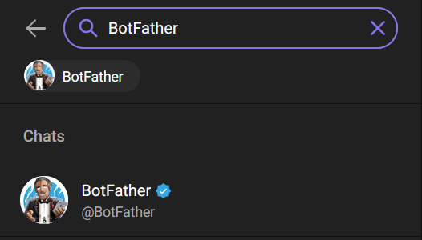
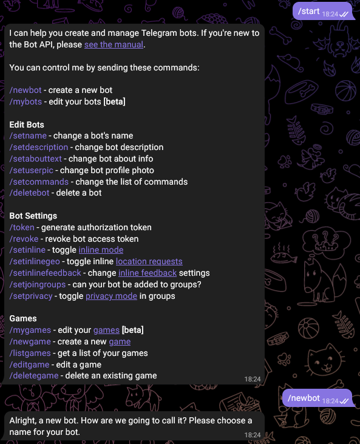
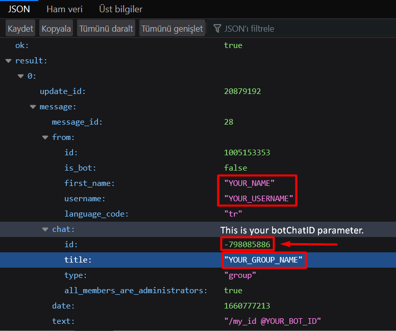
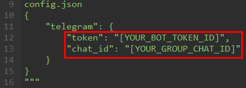

# Picocell SDK Telegram Example Tutorial
## Example Description
Telegram is a globally accessible freemium, cross-platform, cloud-based instant messaging (IM) service. The service also provides optional end-to-end encrypted chats and video calling, VoIP, file sharing and several other features.
In this example, a message will be sent to the Telegram channel via Picocell using the Telegram API.

## System Requirements

### Hardware

- Picocell
- Dual LTE - GNSS Antenna
- Micro USB Cable

### Software

- Thonny IDE
- MicroPython UF2 File
- Telegram App

## Hardware Setup / Preparation

1. **Attach the LTE Antenna to the 	Quectel BG95 Module**
	Connect the GNSS port with the GPS cable and main port with the LTE cable. 
2. **Plug your board into power source**
	
#### Warning!
*For a clean install and avoiding installation errors, plug Micro USB cable into device after the software setup is complete.*


## Software Setup / Preparation
- Thonny is an integrated development environment (IDE) for MicroPython. It supports different ways of stepping through the code, step-by-step expression evaluation. Thonny IDE comes with Python so you can start coding quickly without dealing with tool setups. 


1. **Download Thonny IDE from it's [website](https://thonny.org).**
	- In Thonny, follow Tools > Options > Interpreter. Select MicroPython (Raspberry Pi Pico) in the list as an Interpreter. 

	


2. **Download the necessary UF2 file for Pico board from this [link](https://www.raspberrypi.com/documentation/microcontrollers/micropython.html#drag-and-drop-micropython).**
	
	- Then go ahead and:
		- Push and hold the BOOTSEL button and plug your Pico into the USB port of your computer. Release the BOOTSEL button after your Pico is connected.
	
		

		- It will be mounted as a Mass Storage Device Called RPI-RP2.
		- Drag and drop the downloaded UF2 file onto the RPI-RP2 volume.
3. **Download the repo from GitHub**
- Save the core file in the repo to your Raspberry Pi Pico.
- Open the downloaded file in Thonny IDE and upload it into Raspberry Pi Pico using "Upload to /".

4. **Telegram Bot Configuration**
- Search "BotFather" in Telegram's search bar.





-  Start conversation with BotFather. Type "**/start**" to see all available commands.
-  Use "**/newbot**" command to create a new bot in Telegram.




-  After creating a new bot, continue with typing your bot's name into conversation.
-  Give a username for your bot. (**Warning: Bot's "name" and "username" are different. You will use the "username" in the next steps.**)
- You will given a token automatically for accessing HTTP API. (Your token will look something like this: "**1234567890:XXX9WhkY694zP856M4xNLcr9pXX-xxxxxxx**")
***Warning: Keep your token secure and store it safely!***

5. **Telegram Setup**
- Open Telegram, create a new group or select a group to add the bot.
- Add your bot as a new member.
- Type "/my_id @YOUR_BOT_ID". After this step, your web URL is ready to use. It'll look something like this: *"https://api.telegram.org/bot**YOUR_ACCESS_TOKEN**/getUpdates"*
- Copy this URL to your browser and refresh your page.
- "getUpdates" endpoint gives all the information that you need.
- Type "/my_id @YOUR_BOT_ID" **again**. Refresh your page.

6. **URL Configuration**
- The required parameters are marked in the image below:





7. **Base URL Setup**
- Your base URL should look like this:
*(https://api.telegram.org/bot**YOUR_ACCESS_TOKEN**/sendMessage?chat_id=**YOUR_CHAT_ID**&text=”**TEST_MESSAGE!**”)*

## Test

- Open Thonny IDE.
- Replace marked variables with your own values.





- After all this stages, run the example code. The output you get in the code should look like this: 
```
>>> %Run -c $EDITOR_CONTENT
INFO: Sending message to Telegram channel...
INFO: Result: {'status': 1, 'response': 'timeout', 'interval': 0}
```

- If the process is successful, a message will be sent to the channel as in the photo:


## Example Code Examination

- At the beginning of the code, functions of modem controls and settings are performed. 
```
modem = Modem()
```

- At this part, debug outputs are printed to the shell. User messages will be sent to Telegram.

```
debug.info("Sending message to Telegram channel...")
result = modem.telegram.send_message("Picocell Telegram Example")
debug.info("Result:", result)
```


## Troubleshooting

- If there is a problem occurs while getting updated parameter informations *(see. Step 6)*, reload your browser page after sending "/my_id @YOUR_BOT_ID". You will see the updated JSON information there.


